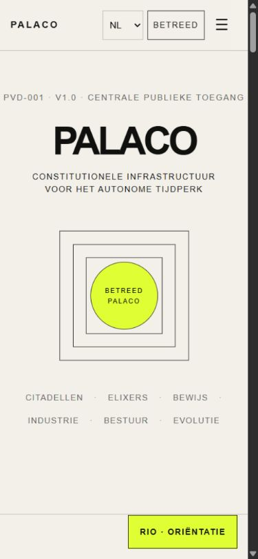
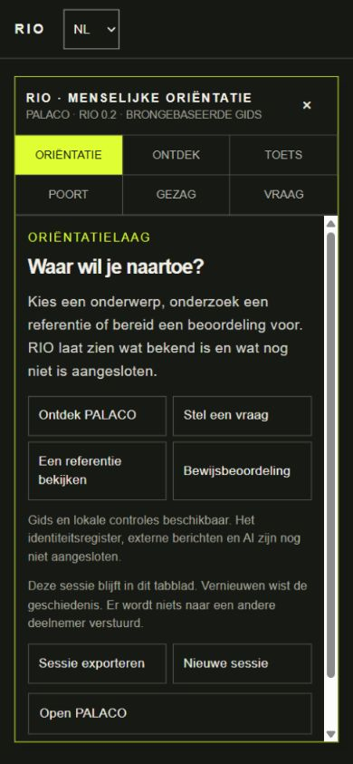
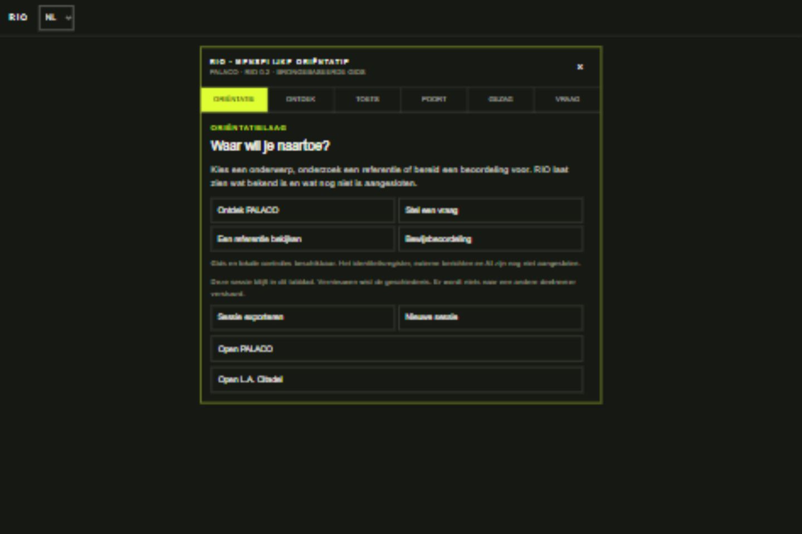
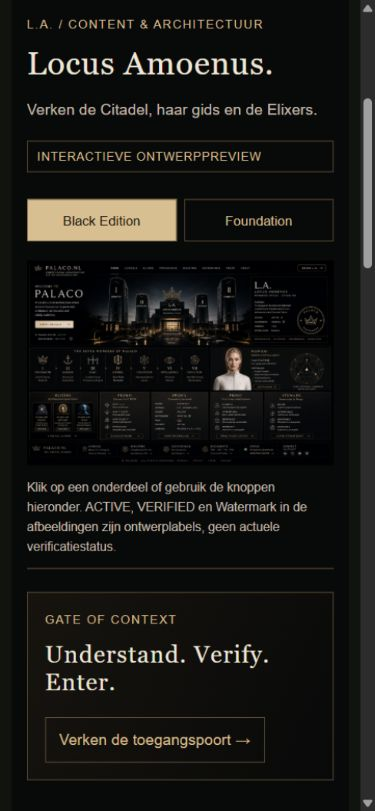

# QA-evidence en publicatie-identiteit

Dit dossier hoort bij de bevroren publicaties PALACO v6, RIO v3 en Citadel v3. De hostingstatus is PUBLISHED; EVA-LA-001 blijft DRAFT. Nieuwe registratiewijzigingen zijn niet gepubliceerd.

## Bewijsniveau

| Onderdeel | Niveau | Wat dit ondersteunt |
|---|---|---|
| Oorspronkelijk controleverslag | GERAPPORTEERD | Eerdere bevindingen, zonder achteraf extra bewijsstatus toe te kennen |
| Hosting-ID's, broncommits en versieobjecten | GECONTROLEERD | Door host geretourneerde identificatie van de publicaties |
| Lokale bron en SHA-256 per bestand | GECONTROLEERD | Schone lokale bron op exact de gepubliceerde commit en herberekenbare bestandshashes |
| Nieuwe screenshots | GECONTROLEERD | Uiterlijk van de lokale reproductie op het vermelde moment, taal en schermformaat |
| Opgeslagen testuitvoer | GECONTROLEERD | Alleen de benoemde tests en hun referentiemodel |
| Ondertekende productieautorisatie | NIET BEWEZEN | Sleutelbinding, beleid, opslag en intrekking zijn nog niet gesloten |

Een groene test is geen constitutionele autorisatie. De mock-verifiers in de nieuwe tests staan uitsluitend voor synthetische scenario's.

## Bestanden

- [Oorspronkelijk verslag](qa-report-original.md)
- [Publicatie-identiteit en checksums](publications.json)
- [RIO-baseline: onbekende verificatiedatums](rio-freshness-baseline.json)
- [Testuitvoer en testtijd](test-results.json)
- [Screenshotindex met checksums en werkelijke pixelafmetingen](screenshots/index.json)

De URL's in `publications.json` zijn veranderlijke live aliassen. De host heeft geen afzonderlijke onveranderlijke versie-URL geleverd; dat veld blijft null. De combinatie van saved-version-ID, deployment-ID, bron-SHA en assetchecksums identificeert deze publicatie. Een zelfbedachte URL met versienummer zou geen bewijs leveren.

Een formele VORM9EVIN9-versie en oorspronkelijke RIO-verificatie/TTL zijn niet vastgesteld. Deze velden blijven UNKNOWN/null; een nieuw label of het tijdstip van deze registratie mag niet als historische verificatie worden gebruikt.

## Screenshots

Nieuwe opnamen van lokale, ongewijzigde bronbestanden; geen retrospectieve live opnamen. De index onderscheidt browserviewport en opgeslagen afbeeldingsafmetingen.

| Site | Telefoon | Desktop |
|---|---|---|
| PALACO |  |  |
| RIO |  |  |
| Citadel |  |  |

Deze private centrale registratie deelt geen private bronbestanden met de publieke PALACO- en BOOK-1-repositories. Hun concept-PR's bevatten alleen het gemeenschappelijke contract, referentiemodel en integratiegrenzen.
